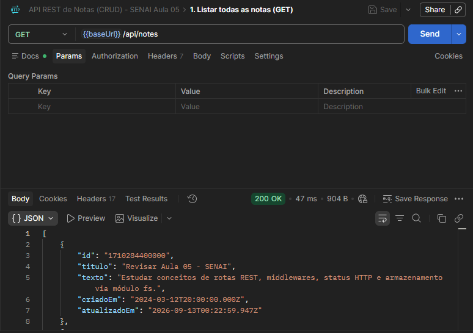
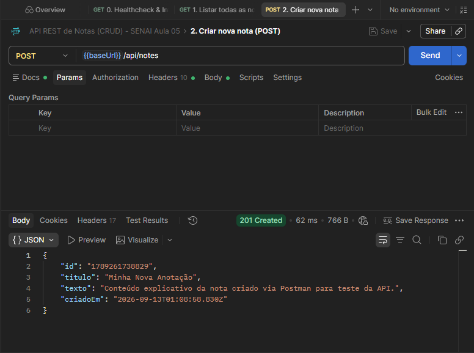
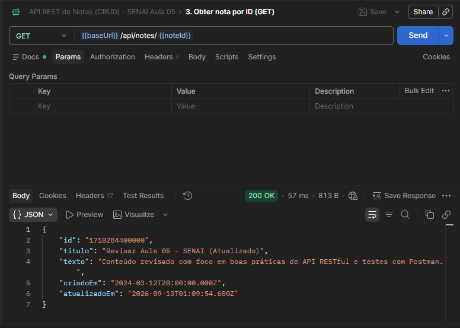
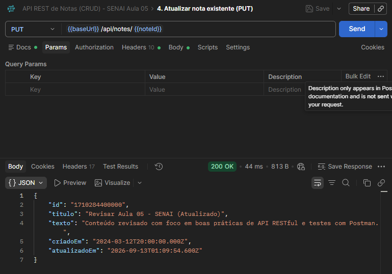
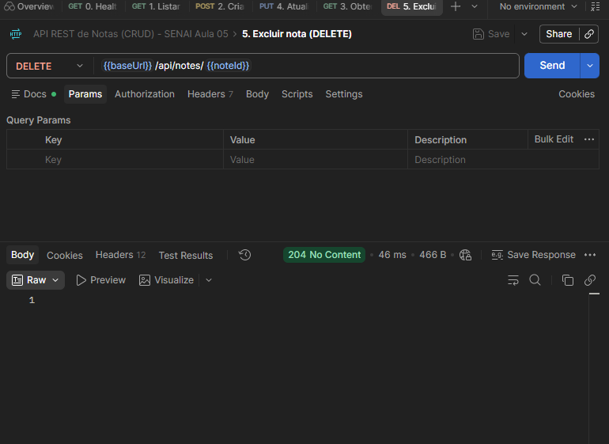
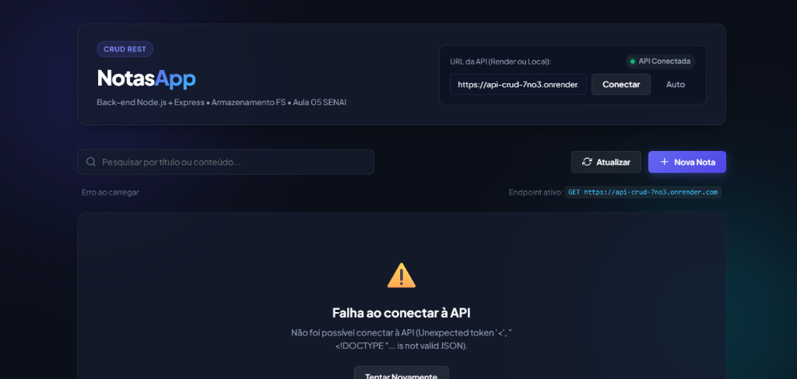

# 📋 Documento de Entrega: API REST de Notas (CRUD) & Front-end

**Instituição:** SENAI  
**Disciplina:** Aula 05 - Criando APIs para o Front-end  
**Docente:** Prof. Deivison Takatu  
**Aluno:** Vinicius Souza  
**Repositório do Projeto:** [https://github.com/ViniciuspSouza23/API-CRUD](https://github.com/ViniciuspSouza23/API-CRUD)

---

## 🔗 1. Links do Projeto

| Recurso | Link / Localização | Status |
| :--- | :--- | :--- |
| **Repositório GitHub** | [github.com/ViniciuspSouza23/API-CRUD](https://github.com/ViniciuspSouza23/API-CRUD) | Ativo / Versionado |
| **Deploy da API (Render)** | [https://api-crud-7no3.onrender.com/api](https://api-crud-7no3.onrender.com/api) | ✅ Online e Operando |
| **Deploy do Front-end (Vercel)** | `https://SEU-APP-NA-VERCEL.vercel.app` *(substitua com sua URL)* | Produção |
| **Coleção Postman** | Arquivo `notes_api_postman_collection.json` na raiz do repositório | Exportável v2.1.0 |

---

## 🛠️ 2. Especificação Técnica da API

A API foi construída em **Node.js** com **Express.js**, utilizando o módulo nativo `fs` para persistência em arquivo local (`data.json`) sem banco de dados tradicional.

### Middlewares Implementados:
1. **CORS Manual:**
   - Header `Access-Control-Allow-Origin: *`
   - Métodos permitidos: `GET, POST, PUT, DELETE, OPTIONS`
   - Headers permitidos: `Origin, X-Requested-With, Content-Type, Accept, Authorization`
   - Interceptação e resposta imediata (`200 OK`) para requisições de preflight `OPTIONS`.
2. **Body-Parser JSON:** `bodyParser.json()` para interpretação e deserialização automática de corpos de requisição `application/json`.
3. **Servidor Estático:** `express.static('frontend')` permitindo execução e teste conjunto local.

### Tabela de Endpoints da API:

| Método | Endpoint | Descrição | Status Sucesso | Status Erro |
| :--- | :--- | :--- | :--- | :--- |
| **GET** | `/api` | Healthcheck e catálogo de rotas | `200 OK` | - |
| **GET** | `/api/notes` | Lista todas as notas salvas no `data.json` | `200 OK` | `500` |
| **POST** | `/api/notes` | Cria nova nota (`titulo`, `texto`). Gera `id` via `Date.now().toString()` e `criadoEm` em ISO | `201 Created` | `400` (campos vazios) |
| **GET** | `/api/notes/:id` | Busca nota específica pelo parâmetro `:id` | `200 OK` | `404 Not Found` |
| **PUT** | `/api/notes/:id` | Atualiza `titulo` e `texto` mantendo `id` e adicionando `atualizadoEm` | `200 OK` | `400` ou `404 Not Found` |
| **DELETE** | `/api/notes/:id` | Remove a nota do arquivo `data.json` | `204 No Content` | `404 Not Found` |

---

## 🚀 3. Guia de Deploy

### 3.1. Deploy do Back-end no Render
1. Acesse o [Render Dashboard](https://dashboard.render.com/) e clique em **New +** &rarr; **Web Service**.
2. Conecte sua conta do GitHub e selecione o repositório `ViniciuspSouza23/API-CRUD`.
3. Preencha as configurações principais:
   - **Name:** `api-crud-notas` (ou à sua escolha).
   - **Region:** Ohio (US East) ou Frankfurt.
   - **Branch:** `main`.
   - **Runtime:** `Node`.
   - **Build Command:** `npm install`
   - **Start Command:** `node server.js`
   - **Plan:** `Free`.
4. Clique em **Deploy Web Service**.
5. O Render injeta automaticamente a variável de ambiente `PORT`, que nosso código já consome perfeitamente com:
   ```javascript
   const PORT = process.env.PORT || 3000;
   ```
6. Copie a URL gerada (ex: `https://api-crud-notas.onrender.com`).

### 3.2. Deploy do Front-end na Vercel
1. Acesse o painel da [Vercel](https://vercel.com/) e clique em **Add New...** &rarr; **Project**.
2. Importe o repositório `ViniciuspSouza23/API-CRUD`.
3. O repositório já inclui o arquivo `vercel.json` configurado para rotear diretamente para os arquivos estáticos da pasta `frontend/`.
4. Clique em **Deploy**.
5. Abra o link gerado pela Vercel e, no campo superior **"URL da API"**, cole o endereço do seu Render (ex: `https://api-crud-notas.onrender.com/api/notes`) e clique em **"Conectar"**.

---

## 📮 4. Como Usar a Coleção do Postman

1. Abra o **Postman**.
2. Clique no botão **Import** (canto superior esquerdo).
3. Selecione o arquivo `notes_api_postman_collection.json` deste repositório.
4. A coleção **"API REST de Notas (CRUD) - SENAI Aula 05"** será importada com todas as 5 requisições documentadas.
5. Na aba **Variables** da coleção, você pode alternar a variável `baseUrl`:
   - Para testes locais: `http://localhost:3000`
   - Para testes em produção: `https://sua-api.onrender.com`
6. Cada requisição já possui exemplos salvos de sucesso (`200`, `201`, `204`) e de erro (`400`, `404`).

---

## 📸 5. Registro de Evidências e Prints do Projeto

> **Instrução:** Tire os prints das telas indicadas abaixo e insira as imagens nesta seção antes da entrega final.

### 5.1. Código-fonte do Back-end (`server.js`)
*Insira aqui o print do seu editor de código mostrando a implementação das rotas e dos middlewares:*  
*(Exemplo: cole a imagem `print_codigo_server.png`)*

---

### 5.2. Testes de Execução no Terminal / Console
*Insira aqui o print do terminal executando `node server.js` e a mensagem de inicialização da porta dinâmica:*  
*(Exemplo: cole a imagem `print_terminal_node.png`)*

---

### 5.3. Requisições no Postman (Evidências de cada Operação CRUD)

#### 1. Listar todas as notas (`GET /api/notes` - Status 200 OK)
Retorna o array completo com as notas persistidas em `data.json`.


---

#### 2. Criar nova nota (`POST /api/notes` - Status 201 Created)
Cria um novo registro gerando automaticamente `id` e timestamp `criadoEm`.


---

#### 3. Obter nota específica por ID (`GET /api/notes/:id` - Status 200 OK)
Busca e retorna com sucesso os dados de uma única nota através do parâmetro de rota `:id`.


---

#### 4. Atualizar nota existente (`PUT /api/notes/:id` - Status 200 OK)
Altera os campos `titulo` e `texto`, adicionando a propriedade `atualizadoEm` e preservando a data de criação original.


---

#### 5. Excluir nota (`DELETE /api/notes/:id` - Status 204 No Content)
Remove a nota com sucesso do arquivo `data.json`, retornando status padrão HTTP 204 sem corpo de resposta.


---

### 5.4. Interface do Front-end em Operação
Demonstração da aplicação web responsiva em execução conectada à API REST:


---

## 🧠 6. Questões para Refletir (Slide Final)

Abaixo constam as análises e respostas aprofundadas sobre as 4 questões teóricas propostas no encerramento da Aula 05:

---

### Questão 1: Quais os principais riscos de segurança deste projeto?

#### Resposta Técnica:
O projeto, por ser didático, possui vulnerabilidades críticas que impediriam seu uso comercial seguro:
1. **CORS Excessivamente Permissivo (`Access-Control-Allow-Origin: *`):**  
   Ao autorizar qualquer origem sem restrições, qualquer página web de terceiros aberta no navegador do usuário pode disparar requisições em nome dele contra a API. Em produção, deve-se restringir a origem estritamente ao domínio do front-end autorizado (ex: `https://meu-front.vercel.app`).
2. **Ausência de Autenticação e Autorização:**  
   Não existem tokens de acesso (como JWT ou cookies de sessão HttpOnly). Qualquer indivíduo que conheça ou descubra a URL pública da API no Render pode consultar todas as notas, modificá-las ou até mesmo limpar todo o conteúdo executando requisições `DELETE` sucessivas.
3. **Ausência de Rate Limiting e Proteção contra Negação de Serviço (DoS):**  
   A API não limita a quantidade de requisições por IP por minuto. Um invasor pode disparar dezenas de milhares de requisições `POST` por segundo, esgotando o espaço em disco do servidor e paralisando a CPU.
4. **Falta de Sanitização e Validação Estrita de Dados (XSS / Injeção):**  
   Os campos `titulo` e `texto` são aceitos sem filtros contra tags HTML maliciosas (`<script>`) ou caracteres de escape. Se o front-end renderizar esses dados via `innerHTML` sem tratamento (escape de entidades HTML), ocorrerá execução arbitrária de scripts (Stored Cross-Site Scripting).
5. **Vazamento de Detalhes de Erros Internos:**  
   Mensagens de erro não tratadas podem expor paths do sistema de arquivos e versões de componentes, facilitando o mapeamento de superfície de ataque por agentes maliciosos.

---

### Questão 2: Usar um arquivo JSON como persistência de dados é uma boa prática para produção?

#### Resposta Técnica:
**Não, o uso de arquivo JSON com `fs` não é recomendado para ambientes de produção.** As razões fundamentais incluem:
1. **Falta de Concorrência Segura (Race Conditions):**  
   Node.js lida com requisições assíncronas. Se duas requisições `POST` ou `PUT` ocorrerem simultaneamente, ambas lerão o estado antigo do arquivo ao mesmo tempo e a última a gravar sobrescreverá as alterações da primeira, gerando perda irreversível de dados (*dirty writes*).
2. **Ausência de Propriedades ACID (Atomicidade, Consistência, Isolamento e Durabilidade):**  
   Caso ocorra uma falha de energia, reinicialização forçada ou estouro de memória no exato instante em que o arquivo estiver sendo gravado (`fs.writeFileSync`), o arquivo `data.json` pode ficar corrompido ou truncado para 0 bytes, inviabilizando o sistema.
3. **Natureza Efêmera de Sistemas em Nuvem PaaS (Render / Heroku / Vercel):**  
   Plataformas como o Render utilizam **containers efêmeros**. Sempre que o servidor reiniciar (deploy, suspensão automática da instância gratuita por inatividade ou manutenção), o sistema de arquivos volta ao estado original do commit do GitHub. Portanto, **todas as notas criadas pelos usuários em produção serão permanentemente apagadas a cada reinício da aplicação**.
4. **Solução Recomendada:**  
   Utilização de Sistemas de Gerenciamento de Banco de Dados (SGBDs) como **PostgreSQL**, **MySQL** (relacionais) ou **MongoDB** (NoSQL / orientado a documentos), hospedados em instâncias dedicadas (ex: Neon, Supabase, Atlas, Render PostgreSQL) com suporte a transações, índices e backups.

---

### Questão 3: Quais seriam as limitações desse sistema se tivéssemos 10.000 notas cadastradas?

#### Resposta Técnica:
Com 10.000 registros de anotações (o que pode facilmente representar entre 5 MB a 20 MB de texto bruto), as seguintes degradações severas ocorreriam:
1. **Consumo Excessivo de Memória RAM (Heap Exhaustion):**  
   Toda chamada a `readNotes()` utiliza `fs.readFileSync` e carrega a totalidade dos 10.000 objetos para a memória do Node.js (`JSON.parse`). Sob concorrência de apenas 10 ou 20 usuários simultâneos, a memória heap do servidor é rapidamente esgotada, gerando lentidão e travamentos por Out of Memory (OOM).
2. **Bloqueio do Event Loop do Node.js:**  
   `JSON.parse()` e `JSON.stringify()` operam de forma síncrona na *Main Thread* do Node.js. Converter uma string de 10 MB em objeto JavaScript bloqueia a execução do servidor por centenas de milissegundos. Durante esse tempo, nenhuma outra requisição HTTP consegue ser atendida, disparando a latência da API.
3. **Escrita Integral e Ineficiente em Disco (Overhead de I/O):**  
   Para alterar uma única palavra em uma nota, ou adicionar uma nota de 2 linhas, o servidor é obrigado a reescrever **os 10.000 registros inteiros** no disco (`fs.writeFileSync`). Isso gera um gargalo massivo de I/O em disco com complexidade de escrita $O(N)$.
4. **Complexidade de Busca Ineficiente:**  
   Como não existem índices estruturados (como árvores B-Tree dos bancos relacionais), a busca de uma nota por ID (`Array.prototype.find`) exige varredura linear $O(N)$ em memória em vez de uma busca indexada instantânea $O(\log N)$ ou $O(1)$.
5. **Falta de Paginação na Rota `GET /api/notes`:**  
   A API retornaria 10.000 objetos em uma única resposta HTTP. O tráfego de rede entre back-end e front-end ficaria pesado, consumindo banda e sobrecarregando o navegador do cliente ao renderizar 10.000 elementos no DOM.

---

### Questão 4: Por que manter todo o código em um único arquivo `server.js` é problemático e como reorganizar o projeto?

#### Resposta Técnica:
A manutenção de todo o código em um arquivo monolítico (`server.js`) acarreta os seguintes problemas de engenharia de software:
1. **Violação do Princípio da Responsabilidade Única (SRP - Single Responsibility Principle):**  
   O `server.js` torna-se uma *God Class* que acumula inicialização do servidor, configuração de rede, middlewares, regras de validação, manipulação do sistema de arquivos e tratamento de requisições HTTP.
2. **Dificuldade Extrema de Manutenção e Trabalho em Equipe:**  
   Quando múltiplos desenvolvedores alteram o mesmo arquivo para rotas distintas, o controle de versão (Git) gera recorrentes conflitos de merge (*merge conflicts*).
3. **Impossibilidade de Testes Automatizados Isolados:**  
   Não é possível testar as regras de persistência ou lógica de negócio isoladamente sem subir o servidor Express inteiro e disparar requisições HTTP de ponta a ponta.

#### Como Reorganizar o Projeto em Arquitetura em Camadas (Layered Architecture):
A estrutura recomendada para evolução profissional divide as responsabilidades em pastas modulares:

```text
api-crud/
├── src/
│   ├── config/             # Configurações de ambiente, portas e constantes
│   │   └── environment.js
│   ├── middlewares/        # Middlewares reutilizáveis
│   │   ├── cors.middleware.js
│   │   ├── error.middleware.js
│   │   └── validator.middleware.js
│   ├── routes/             # Definição e mapeamento dos endpoints
│   │   └── note.routes.js
│   ├── controllers/        # Recebem req, validam entrada e enviam res
│   │   └── note.controller.js
│   ├── services/           # Regras de negócio da aplicação
│   │   └── note.service.js
│   ├── repositories/       # Camada de acesso aos dados (fs ou banco de dados)
│   │   └── note.repository.js
│   └── app.js              # Configuração da aplicação Express
├── server.js               # Apenas escuta na porta e inicializa o app
├── data.json
└── package.json
```

**Benefícios dessa Reorganização:**
- **Desacoplamento:** Para trocar o armazenamento de `data.json` para MongoDB ou PostgreSQL, altera-se apenas a camada de `repositories`, sem tocar em controllers ou rotas.
- **Testabilidade:** Cada service e controller pode ser testado unitariamente com mocks (ex: com Jest ou Vitest).
- **Escalabilidade:** Novas entidades (ex: usuários, categorias de notas, tags) são adicionadas em arquivos dedicados sem interferir nas rotas existentes.
